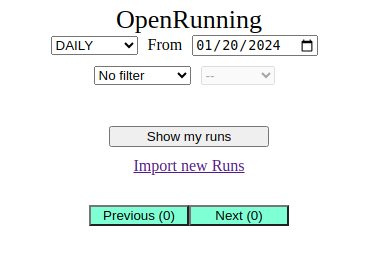

# OpenRunning: GPX Manager for Running Data

OpenRunning is an application that generates statistics about running session. Users upload their GPX files and visualize
graphs with speed, length, pace, etc.

1. [Use the Application](#use-the-application)
2. [Running the application](#running-the-application)
  * [First Run](#first-run)
  * [Check your Run](#check-your-run)
3. [Application Architecture](#application-architecture)
4. [Docker Containers](#docker-container)
  * [Docker Container Connection](#docker-container-connection)
  * [Docker Container Configuration](#docker-container-configuration)
5. [Developer Environment Configuration](#developer-environment-configuration)
  * [Backend](#backend)
  * [Frontend](#frontend)

## Use the Application
Once the [application is running](#running-the-application), we are ready to use it!

- Open the URL [http://localhost:8000](http://localhost:8000) to see the login page:


- Click on the link `New user? Sign up first!` to sign up:


- Fill the form with an email address (which must include '@') and a password (no restriction here). For now, the email
  address is not used so you can use `myaccount@forme`.

- After clicking on the `Create new user` button, we are back to the login page. We can login with the created account to
land on the home page:



- Click on the `Import new runs` link to import GPX files:


- Click on the `Select GPX files` button to select files, then, click to the `Upload` button to send them to the backend API.

- Come back to the home page to see the statistics about your runs!

**IMPORTANT**: At the moment, the GPX files are not automaticcally processed. You have to connect to the backend container
to run the `gpxprocessor` manually.

## Running the Application
### First Run
The easy way to start the application is to use [docker](https://docs.docker.com/engine/install/) with the `compose` plugin.
To run the application without docker, see the section [Developer Environment Configuration](#developer-environment-configuration).

- install [docker](https://docs.docker.com/engine/install/)
- clone this repository
```
https://github.com/info7tik/openrunning.git
```
- start the application with docker compose
```
cd openrunning
docker compose up -d
```
This command should start four containers:
* the `database` container contains the mariaDB database. It stores all the information about the GPX files.
* the `backend` container contains the API of the application. It stores the GPX files and expose the data of the
  database to the frontend.
* the `processor` container contains the GPX processor. It processes the GPX files and fill the database.
* the `frontend` container contains the web application that it binds to the port 4200.
Open the URL [http://localhost:4200](http://localhost:4200) to connect to the application.

### Check your Run
#### Database Check
* Install the MySQL client `sudo apt install mariadb-client` or `sudo apt install mysql-client`.
* Connect to the database with `mysql -uroot -pdbroot -h127.0.0.1 -P3333`
* Check the database `openrunning` exists:
```
mysql> use openrunning;
Database changed
```
* Check the tables exist:
```
mysql> show tables;
+-----------------------+
| Tables_in_openrunning |
+-----------------------+
| frequencies           |
| gpxfiles              |
| records               |
| samples               |
| tracks                |
| users                 |
+-----------------------+
6 rows in set (0,00 sec)
```
*NOTE: the number and the names of the tables can change but you must have tables.*

#### Backend Check
* Send a GET request to the backend API with the `curl` command:
```
curl http://localhost:8080/user/test
```
The response should be `{ "message": "That works!" }`.

#### Frontend Check
* Open the URL [http://localhost:4200](http://localhost:4200) with your favorite web client. You should see the ugly login
login page (maybe it looks better now):


#### Docker Container Logs
To see the logs of the containers, use the following commands **from the openrunning directory**:
```
docker compose logs database
docker compose logs --follow backend
docker compose logs --follow processor
docker compose logs --follow frontend
```

## Docker Containers
### Docker Container Connection
To connect to the containers, use the following command **from the `openrunning` directory**:
```
docker compose exec -it container_name bash
```
The container names are: `frontend`, `backend`, `database`. These names are defined in the docker compose [file](./docker-compose.yaml).

To list the running containers, use `docker ps`.

The containers are based on Linux debian. See the exact version of the operating system in the docker files:
* [backend configuration](./docker/backend.dockerfile)
* [frontend configuration](./docker/frontend.dockerfile)

### Docker Container Configuration
* Change the `database` port by editing [docker-compose.yaml](./docker-compose.yaml):
```
  database:
    image: mariadb:11.3-rc
    environment:
      MARIADB_USER: ${E_DB_USER}
      MARIADB_ROOT_PASSWORD: ${E_DB_ROOT_PASSWORD}
      MARIADB_DATABASE: ${E_DB_DATABASE}
    volumes:
      - ./db_data:/var/lib/mysql
    ports:
      - 3333:3306
    restart: always
```
By default, the database uses the port `3333` of your machine (localhost). Change this value to change the port.

* Change the `backend` port by editing [docker-compose.yaml](./docker-compose.yaml):
```
  backend:
    build:
      context: .
      dockerfile: docker/backend.dockerfile
    depends_on:
      - database
    ports:
      - 8080:8080
    restart: always
```
By default, the `backend API` uses the port `8080` of your machine (localhost). Change this value to change the port.

* Change the `frontend` port by editing [docker-compose.yaml](./docker-compose.yaml):
```
  frontend:
    build:
      context: .
      dockerfile: docker/frontend.dockerfile
    depends_on:
      - backend
    ports:
      - 4200:80
    restart: always
```
By default, the `frontend web application` uses the port `4200` of your machine (localhost). Change this value to change the port.

## Developer Environment Configuration
The easy setup is to run the application on your local system without the containers. In the following configuration, we
connect the `backend` module and the `gpxprocessor` module to the database running inside the container. This database
is binded to the local port 3333.

### Backend
* Then, open the `backend` project in your IDE (here, VSCode):
  * `File > Open Folder...` and select the `backend` directory
  * `File > Add Folder to Workspace...` and select the `model` directory

* Execute the same operations to open the `gpxprocessor` project:
  * `File > New Window`
  * `File > Open Folder...` and select the `gpxprocessor` directory
  * `File > Add Folder to Workspace...` and select the `model` directory

* Start the `backend` project:
  * from the IDE: open `backend/src/main/java/fr/openrunning/orbackend/Application.java` and click on `Run` above the `main()` method
  * from the JAR (compilation is required):
  ```
  cd model
  mvn clean install -DskipTests
  cd ../backend
  mvn clean package -DskipTests
  java -jar target/orbackend-*.jar
  ```

* Start the `gpxprocessor` project:
  * from the IDE: open `gpxprocessor/src/main/java/fr/openrunning/gpxprocessor/Application.java` and click on `Run` above the `main()` method
  * from the JAR (compilation is required):
  ```
  cd model
  mvn clean install -DskipTests
  cd ../gpxprocessor
  mvn clean package -DskipTests
  java -jar target/gpxprocessor-*.jar
  ```

*NOTE: It could be more efficient to open the `backend` project and the `gpxprocessor` project in two different windows.*

### Frontend
* Run the `frontend` module
```
cd frontend
npm start
```
*NOTE: To debug in VSCode, hit `Ctrl+Shift+P` then select `Debug: Toggle Auto Attach` and `Always`. Now, we can run the `npm start` command in a **new** integrated terminal of VSCode.*
